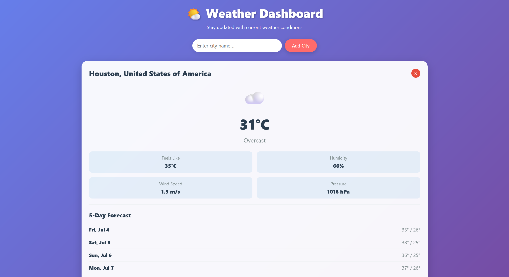

# weatherdash

responsive weather dashboard built with Vue.js that displays current weather conditions and 5-day forecasts for multiple cities



## Features

-  **Global Weather Data** - should be able to search and add any city worldwide
-  **Local Storage** - cities are saved between sessions
-  **Real-time Data** - live weather updates from WeatherAPI
-  **5-Day Forecast** - see upcoming weather patterns

## Demo

Try it with these cities:
- London
- New York
- Tokyo
- Sydney
- Paris

## Usage

1. **Add Cities**: type a city name and click "Add City" or press Enter
2. **View Weather**: see current conditions, detailed metrics, and 5-day forecast
3. **Remove Cities**: then click the × button on any city card
4. **Persistent Storage**: your cities are automatically saved

## API Information

my dashboard uses [WeatherAPI.com](https://www.weatherapi.com/)

### Alternative APIs

Want to use a different weather service? The code can easily be adapted for:
- **OpenWeatherMap** (1,000 free calls/day)
- **Open-Meteo** (completely free, no API key needed)
- **AccuWeather** (50 free calls/day)

## Tech Stack

- **Vue.js 3** - Reactive frontend framework
- **Vanilla CSS** - Custom styling with glassmorphism effects
- **WeatherAPI.com** - Weather data provider
- **Local Storage** - Data persistence

## File Structure

```
monoindex.html
├── html Structure
├── css Styling
│   ├── Responsive grid layout
│   ├── Glassmorphism effects
│   └── Smooth animations
└── js (Vue.js)
    ├── Weather API integration
    ├── Local storage management
    └── Reactive data handling
```

## License

This project is open source and available under the MIT License.

## Credits

- Weather data provided by [WeatherAPI.com](https://www.weatherapi.com/)
- Built with [Vue.js](https://vuejs.org/)

---

**enjoy tracking the weather!** 

For questions or suggestions, feel free to reach out or open an issue.